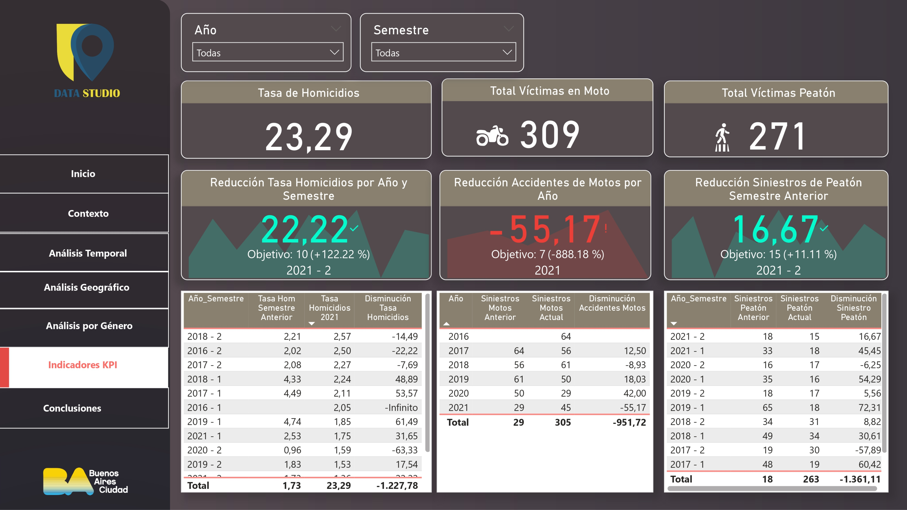
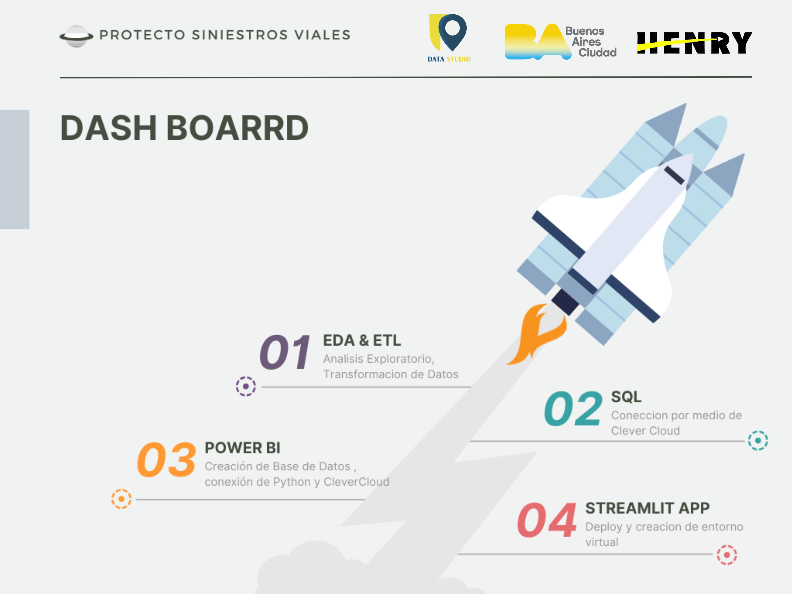
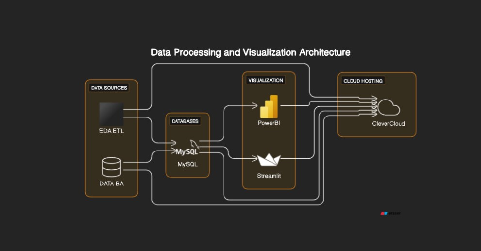
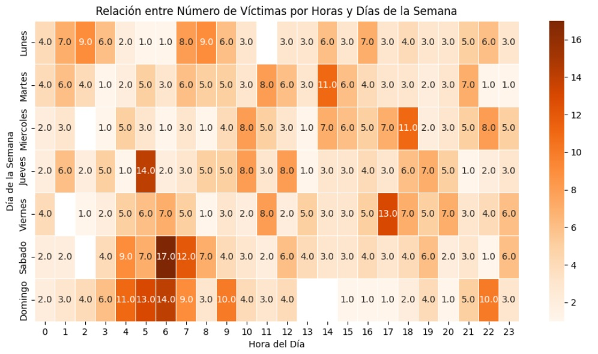
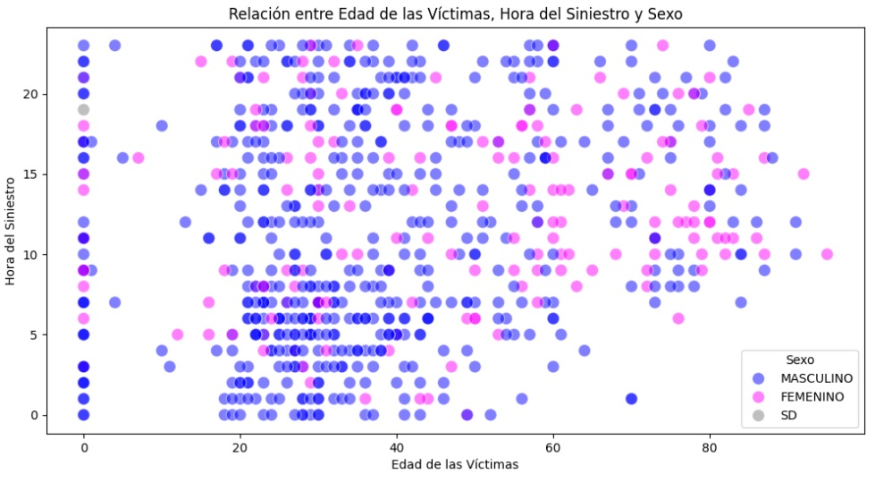

    

    
   
      

## **Introducción**⚠️ 🚧

- **CLIENTE:** Observatorio de Movilidad y Seguridad Vial (OMSV), bajo la órbita de la Secretaría de Transporte del Gobierno de la Ciudad Autónoma de Buenos Aires (CABA).

- **OBJETIVO:** Es lograr información que permita la toma de decisiones, de manera fundada, a quienes corresponda; a fin de lograr la prevención, el aumento de la seguridad vial y disminución de siniestros viales con víctimas fatales en la Ciudad de Buenos Aires. 

- **INDICADORES:** Las tasas de mortalidad relacionadas con siniestros viales es un indicador crítico de la seguridad vial en una región. Reducir estas tasas es un objetivo clave para mejorar la seguridad vial y proteger la vida de las personas en la ciudad.

Se utilizan son derivados de un dataset con información sobre homicidios de siniestros viales en la Ciudad de Buenos Aires, durante los años 2016-2021, que es de píblico acceso en la página oficial de CABA. [Datos oficiales](https://data.buenosaires.gob.ar/dataset/victimas-siniestros-viales)

[Indec](https://www.indec.gob.ar/ftp/cuadros/poblacion/cnphv2022_resultados_provisionales.pdf)

## **Contexto**⚠️ 🚧

Los siniestros viales, conocidos como accidentes de tráfico son eventos que involucran vehículos en las vías públicas y que pueden tener diversas causas, como colisiones entre automóviles, motocicletas, bicicletas o peatones etc.  Los expertos en la materia indican que en Argentina es dos o tres veces más alta la probabilidad de que una persona muera en un siniestro vial que en un hecho de inseguridad delictiva. Por todo ello, el estudio del problema para la prevención y disminución de Siniestros viales es esencialmente importante para las autoridades.

Los informes del Sistema Nacional de Información Criminal (SNIC), del Ministerio de Seguridad de la Nación, revelan que entre 2018 y 2022 se registraron 19.630 muertes en siniestros viales en todo el país. Estas cifras equivalen a 11 personas por día que resultaron víctimas fatales por accidentes de tránsito. Solo en 2022, se contabilizaron 3.828 muertes fatales en este tipo de hechos.

## **Dashboard Interactivo Power BI**⚠️ 🚧

 

 

## **Etapas del Proyecto**⚠️ 🚧

  

### ⛔ Datos

+ `Proceso de ETL (Extraccion, Transformacipon y Carga)` [ETL](2A_ETL/ETL.ipynb).

Para este proyecto se trabajó con la **Bases de Víctimas Fatales en Siniestros Viales** que se encuentra en formato de Excel y contiene dos pestañas de datos:

 * **HECHOS**: que contiene una fila de hecho con id único y las variables temporales, espaciales y participantes asociadas al mismo.

 * **VICTIMAS**: contiene una fila por cada víctima de los hechos y las variables edad, sexo y modo de desplazamiento asociadas a cada víctima. Se vincula a los HECHOS mediante el id del hecho. En este documento se detallan todas las definiciones manejadas en los datos y en el desarrollo de este proyecto. [Documento](6_Assets/NOTAS_HOMICIDIOS_SINIESTRO_VIAL.pdf)
Por otra parte, en este [link](https://data.buenosaires.gob.ar/dataset/victimas-siniestros-viales) se encuentran los datos utilizados en el análisis.

### ⛔ Análisis de los datos

+ `Proceso de EDA (Análisis Exploratorio de los datos)` [EDA](2B_EDA/EDA.ipynb)
  
+ `Análisis Temporal:` 
El mapa de calor indica que los días de fin de semana, en especial sábados y domingos se encuentran con un número más alto de víctimas fatales, siendo las horas entre 03.00 hs y 09.00 hs.
Los horarios críticos de los siniestros viales están relacionados con los momentos del ingreso a la jornada laboral (5-9h), el momento del almuerzo (12-14h) y la salida del trabajo (17-18h). Mientras que los fines de semana están relacionados con las salidas nocturnas (4-7h)

+ `Análisis Demográfico y Geográfico:`

Edad de las víctimas : La distribución del rango etario de víctimas, resulta para los `Masculinos` entre 20 y 40 años; mientras que para los `Femeninos` entre 40, 60 y 80 años. El patrón de correlación Edad y Hora de las variables númericas se analiza agregando la variable Sexo, de lo que resulta la conclusión que los horarios en que los accidentes son protagonizados por Masculinos es al horario de ingreso y egreso laboral, mientras que para los Femeninos es en el horario cercano al almuerzo.

+ `Análisis Geográfico:`

Utilizando la herramienta GeoPandas y extrayendo los datos de los detalles de los Barrios que conforman las 15 comunas de CABA; resulta el análisis de las coordenadas geográficas y comunas de CABA, que demostro que las comunas con más siniestos son las 1, 4 , 9, 8 y 7.
Los siniestros se producen en 62% de los casos en el tipo de calle `Avenida` y en el 82% de los casos se corresponden con un Cruce entre calles. Lo que resulta un patrón que se repite a lo largo de los años.

### ⛔ Dashboard 

Se utliza la herramienta Streamlit para desarrollar una app mostrar el `dashboard` resultante de manera interactiva. [link](https://datasiniestrosviales.streamlit.app/)

### ⛔ Indicadores de Rendimiento Clave KPI

+ **Reducir en un 10% la tasa de homicidios en siniestros viales de los últimos seis meses, en CABA, en comparación con la tasa de homicidios en siniestros viales del semestre anterior**

+ **Reducir en un 7% la cantidad de accidentes mortales de motociclistas en el último año, en CABA, respecto al año anterior**

+  **Reducir en un 15% la cantidad de accidentes con víctimas fatales de peatones en el último semestre, en CABA, respecto al semestre anterior.**

## **Conclusiones**⚠️ 🚧

## Autor:    

  
   
  Karina Kozlowski 
   
  
  

